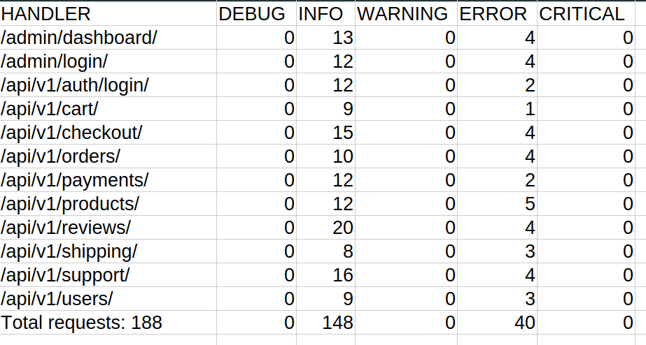
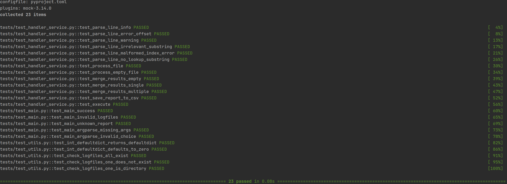

### Тестовое задание Django Logs
<hr>

### Требования:

 - Установленный пакетный менеджер uv (<a href="https://docs.astral.sh/uv/getting-started/installation/">инструкция по установке</a>).


### Установка:

- выполнить команды:
    ```
    git clone https://github.com/OneHandedPirate/django-logs-test.git
    cd django-logs-test
    uv sync
    ```
  
### Запуск:

- пример команды запуска CLI-утилиты:
    ```
    uv run main.py "logs/app1.log" "logs/app2.log" "logs/app3.log" --report handlers
    ```
    - Файлы с логами - тестовые файлы из ТЗ.
    - по итогу работы сформируется csv-файл `handlers.csv`
    
      

- запуск тестов:
  ```
  uv run pytest -v
  ```
  
  
  